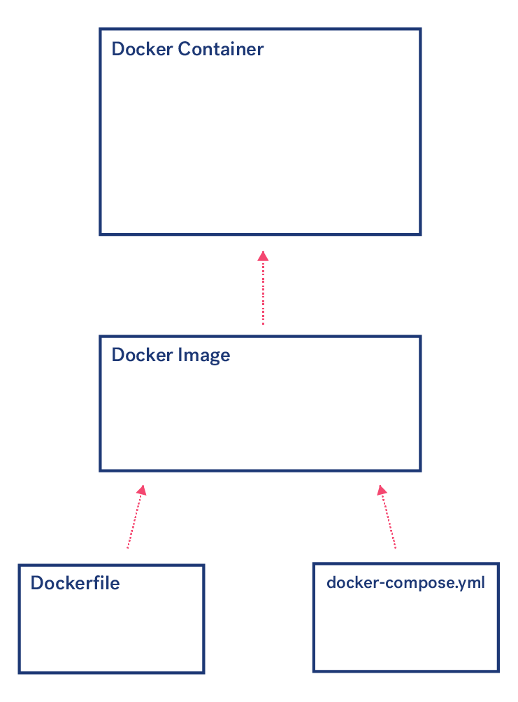
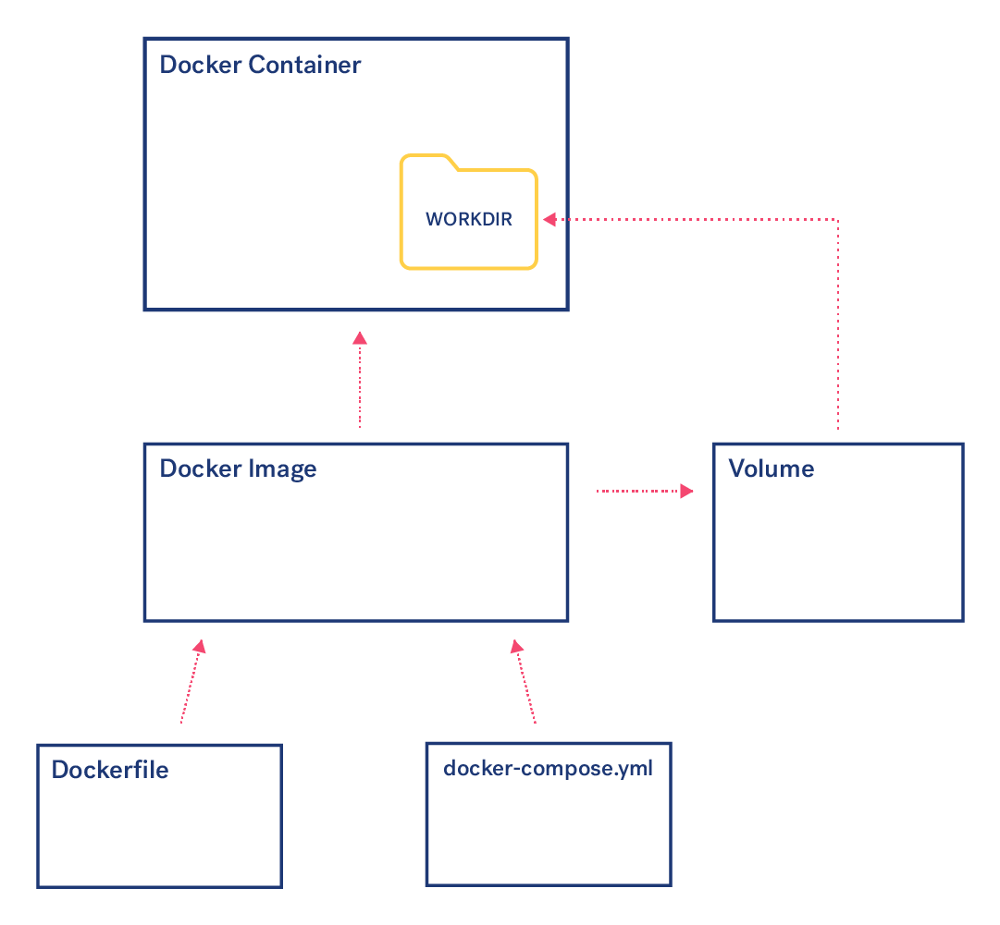

:::note Это перевод статьи
Это перевод [статьи из блога TWG](https://twg.io/blog/things-i-wish-i-knew-about-docker-before-i-started-using-it/) инженера-программиста Николь Чанг, в которой она рассказывает о своих впечатлениях о Докере, инструменте для разработчиков, позволяющем упаковывать, отправлять и запускать любое приложение в виде самодостаточного контейнера, который работает где угодно — от ноутбука до любого крупного облачного сервиса.
:::

<!--truncate-->


Когда я только начинала изучать Докер, я смотрела его документацию, читала статьи в блогах, листала книги и использовала чужие публичные git-репозитории для справки. Все эти ресурсы не очень-то мне помогли.

На сайте Stack Overflow я обнаружила, что многие люди задавали те же вопросы, что и я:

1. Что такое `WORKDIR`, где он находится и как он работает на самом деле?
1. Почему докер-контейнер не обновляется, когда я меняю `Dockerfile`? (Как в Докере устроено кеширование?)
1. Что такое *Docker compose*, и зачем мне его использовать?
1. Как войти в запущенный контейнер по ssh?
1. Куда поместить код и данные, которые должны храниться вне докер-контейнера? Что делать, если мне нужно уничтожить приложение, но сохранить базу данных? (подсказка: *Docker volumes*)

## Что такое `WORKDIR`, где он находится и как он работает на самом деле?

Вот пример `Dockerfile`:

```
FROM node:alpine
WORKDIR /usr/src/app
```

Здесь я использую `node:alpine` как основу для своего образа (это популярный образ из-за своего маленького размера).

Далее я указываю `/usr/src/app` в качестве рабочей директории для файлов проекта, которые позже помещу сюда.

Так вот, `WORKDIR` это ваша рабочая директория. Она существует только внутри контейнера. По умолчанию Докер создает папку `/usr`. Так что папка `/usr` почти всегда будет присутствовать в образе.

Если вы хотите, чтобы ваша рабочая директория находилась в совсем другой папке, вам нужно сначала создать эту папку:

```
FROM node:alpine
MKDIR app
WORKDIR app
```

Чаще всего `WORKDIR` будет идти сразу после команды `FROM` в докерфайлах. Это потому что остальные команды в этом файле, такие как `RUN`, `CMD`, `ENTRYPOINT`, `COPY` или `ADD`, будут выполняться уже внутри директории, указанной в `WORKDIR`.

На самом деле, единственная команда `RUN`, которую можно вставить перед командой `WORKDIR`, — это установка любых зависимостей, которые вы хотели бы видеть глобальными в своем контейнере. Все остальное должно быть в рабочей директории, указанной в `WORKDIR`.

## Почему мой докер-контейнер не меняется, когда я меняю `Dockerfile`? (Как в Докере устроено кеширование?)

Каждая команда (строчка) в `Dockerfile` кешируется. Вообще, кеширование устроено непросто, но если вы посмотрите на логи в командной строке, вы увидите примерно такое:

```
Step 2 : RUN npm install -g nodemon
 — -> Using cache
 — -> <some hash goes here>
Step 3 : WORKDIR /app
 — -> Using cache
 — -> <some hash goes here>
Step 4 : COPY package.json .
 — -> <some hash goes here>
Removing intermediate container <some hash goes here>
Step 7 : RUN npm install
 — -> Running in <some hash goes here>
```

Обратите внимание на вот такие строчки:

```
— -> Using cache
```

Если ваш код не менялся с того момента, когда вы последний раз изменили свой `Dockerfile`, и Докер воспользовался закешированными данными, это хорошо. Но что делать, если файлы вашего приложения изменились? Например, если вы установили новые зависимости в `package.json`, или изменили код в любом из файлов, которые вы ранее скопировали или добавили в контейнер через команды `COPY` или `ADD`.

Смысл кеша в том, чтобы ускорить время сборки. Кеширование отлично подходит для вашего базового образа (см. `FROM`), поскольку загрузка этого образа занимает много времени, а сами образы меняются очень редко. Однако кеширование может доставить много боли пока вы создаете докер-контейнер.

Если вы уверены, что не будете менять свой `Dockerfile` в ближайшие несколько месяцев, можно смело использовать кеширование, но важно понимать, что именно кешируется, иначе вы столкнетесь с неприятными, отнимающими время сюрпризами, когда измените свой код, а в докер-контейнере ничего не изменится.

Из-за того, как работает кеширование в Докере, вы частенько можете оказаться в ситуации, когда не увидите никаких обновлений после изменения файлов `Dockerfile` и `docker-compose.yml`, или кода приложения. Для решения этой проблемы есть несколько полезных команд, приведенных ниже.

- Удалить все докер-контейнеры (нужно запустить до того, как удалять докер-образы):
  `$ docker rm $(docker ps -aq)`
- Удалить все докер-образы:
  `$ docker rmi $(docker images -q)`

Таким образом вы уничтожите все докер-образы и докер-контейнеры на своем компьютере. После этого вам придется собрать заново образы и поднять контейнеры, что сделает следующую сборку медленной (поскольку она не использует данные из кеша). Однако это позволит вам увидеть свои обновления.

Еще можно указать флаг `--no-cache` при сборке докер-образа.

Для удобства можно создать алиасы для запуска докер-комманд в консоли:

```
alias dockerrm=’docker rm $(docker ps -aq)’

alias dockerrmi=’docker rmi $(docker images -q)’
```

## Что такое *Docker compose*, и зачем мне его использовать?



*`Dockerfile` можно использовать в сочетании с `docker-compose.yml` для создания образа.*


***Docker compose*** удобен тем, что:

- ***Docker compose*** можно использовать для управления несколькими контейнерами одновременно — что зачастую и происходит. У вас может быть один контейнер для API, второй контейнер для базы данных, третий — для кеша Redis.
- Благодаря ***Docker compose*** вы можете запустить все три контейнера одновременно с помощью команды `docker-compose up`, а затем остановить их вызвав `docker-compose down`.
- ***Docker compose*** позволяет перенести большинство опций, которые используется в команде `docker run` из docker cli, в файл `docker-compose.yml`.

Третий пункт, на мой взгляд, самый полезный. Ужасно не удобно запоминать кучу опций docker cli, которые вы будете либо перепечатывать, либо копировать и вставлять снова и снова. Вместо этого вы можете просто поместить их в файл `docker-compose.yml`, и использовать короткие команды для запуска и остановки контейнеров.

Кроме того, я заметила, что опции docker cli очень часто меняются разработчиками Докера, в отличие от инструкций в файле `docker-compose.yml`. Если вы наткнетесь на старую статью по Докеру, то, скорее всего, там будут приведены устаревшие флаги для docker cli.

***Docker compose*** будет полезен, если вам нужно разделить девелоп-образ, который вы используете для разработки, и продакшен-образ, который вы выкладываете для общего использования. Используя флаг `-f` вы можете вызывать через `docker compose` разные `docker-compose.yml` файлы. В случае с разделением образов на девелоп и продакшен, ваши команды будут выглядеть так:

```
$ docker-compose -f docker-compose.dev.yml up
$ docker-compose -f docker-compose.prod.yml up
```

Так я могу указать специфические для локальной разработки инструкции в соответствующем докерфайле:

```
services:
  <name of my service, like 'server'>:
  build:
  context: .
  dockerfile: Dockerfile.dev
```

В добавок, если вы используете Docker compose, вы можете создать образ без кеша:

```
$ docker-compose build — no-cache
```

## Как войти в запущенный контейнер по ssh?

Настраивая докер-образ вам иногда придется заходить по ssh в запущенный докер-контейнер, чтобы посмотреть, что там происходит.

В зависимости от базового образа, который вы используете (см. строку `FROM` в вашем докерфайле), у вас может быть установлен или не установлен bash. Если у вас нет bash, вы можете использовать старый добрый sh. С помощью shell вы все равно сможете перемещаться по каталогу, перечислять файлы в каталоге и просматривать файлы с помощью `cat`.

Вот так можно посмотреть все запущенные контейнеры:

```
$ docker ps
```

Эта команда выведет список всех запущенных контейнеров, их id, и статусы.

А вот так можно войти в конкретный контейнер:

```
$ docker exec -it <container_id> sh
```

В случае, если в контейнере установен bash, вход в контейнер быдет выглядеть так:

```
$ docker exec -it <container_id> /bin/bash
```

С помощью docker compose вы можете войти в контейнер с помощью ssh:

```
$ docker-compose exec <container_id> sh
```

## Куда поместить код и данные, которые должны храниться вне докер-контейнера? Что делать, если мне нужно уничтожить приложение, но сохранить базу данных?

Подсказка: ***Docker volumes***.

Докер отлично подходит для создания образов ("чертежей" контейнеров, которые размещаются в хранилище) и контейнеров (экземпляров образов). Все, что создается в докер-контейнере, не может измениться во время выполнения.

Это означает, что докер-контейнеры — не лучшее место для хранения кода вашего приложения или данных из базы данных. Вы столкнетесь с этим, когда будете проходить уроки по Докеру, и заметите, что приходится пересобирать свой контейнер каждый раз, когда меняете код.

Для кода и данных, которые должны изменяться во время выполнения, лучше использовать инструкцию `VOLUMES`. Думайте о ***volume***, как о папке, которую вы монтируете в рабочую область `WORKDIR` докер-контейнера.



***Volumes*** находятся вне докер-образа. Они хорошо подходят для изменяемых вещей, таких как код приложения и данные базы данных.

Ну а самый простой способ настроить ***volume***, это воспользоваться ***docker compose***. Типичная настройкак ***volume*** в файле `docker-compose.yml` выглядит так:

```
volumes:
 — '.:/src/app'
 — /src/app/node_modules
```

Описанная выше настройка, означает, что у меня есть пака `/src/app` в рабочей директории, которую я ранее создала в своем `Dockerfile`:

```
WORKDIR /src/app
RUN npm install
```

Обратите внимание на двоеточие `:`. Это важно. Слева от двоеточия находится ваша локальная папка по относительному пути. Справа — папка в вашем докер-контейнере (скорее всего, это будет `WORKDIR`).

Также обратите внимание, что у вас может быть несколько ***volumes***, и если вы не вставите двоеточие `:`, то Докер будет рассматривать эту папку в `WORKDIR` (в данном случае `/src/app/node_modules`) как часть вашего ***volume***.

Если вы используюте Node и npm, то строка без двоеточия (`/src/app/node_modules`) понадобится вам, чтобы ваш код и `node_modules` находились в одном `WORKDIR`. ***Volumes*** монтируются во время выполнения и скрывают то, что было установлено через `RUN` в ваш `WORKDIR` во время сборки.

Установка `node_modules` таким образом также ускоряет время сборки, поскольку этот слой (`RUN npm install`) кешируется.

Для баз данных, таких как `PostgreSQL`, часто требуются специальные инструкции для Докера. В примере ниже мы даже не будем указывать `Dockerfile`, вместо этого мы просто создадтм экземпляр в `docker-compose.yml`:

```
services:
  db:
    # https://hub.docker.com/_/postgres/
    image: postgres:9.6
    restart: always
    volumes:
      — ./pgdata:/var/lib/postgresql/data/pgdata
    ports:
      — ‘5432:5432’
    environment:
      POSTGRES_PASSWORD: 'password'
      POSTGRES_DB: your_database
      PGDATA: /var/lib/postgresql/data/pgdata
```

Затем в нашем API сервисе мы укажем контейнер `postgres`:

```
services:
  api:
    build:
      context: .
      dockerfile: Dockerfile
    container_name: my_api_module
    volumes:
      - '.:/src/app'
      - /src/app/node_modules
    ports:
      - '8080:8080'
    links:
      - db
    depends_on:
      - db
    environment:
      NODE_ENV: 'development'
      DATABASE_URL: 'postgres://postgres:password@db/your_database'
```

## В заключение…

Надеюсь, эти советы пригодятся вам при разработке докер-образов. Если у вас есть советы и предложения для автора оригинальной статьи, пожалуйста, напишите их в комментариях к статье ["Things I Wish I Knew About Docker Before I Started Using It"](https://twg.io/blog/things-i-wish-i-knew-about-docker-before-i-started-using-it/).

- - -

Если вам был полезен этот перевод добавляйте меня в друзья [в Гитхабе](https://github.com/sgromkov/) и [в Твиттере](https://twitter.com/GromkovSergey).

И если вам нравится, что я делаю, поддержите меня [на Патреоне](https://www.patreon.com/sergey_gromkov) ❤️.

Советы и замечания оставляйте [в Issues моего сайта](https://github.com/sgromkov/gromkov.me/issues).
