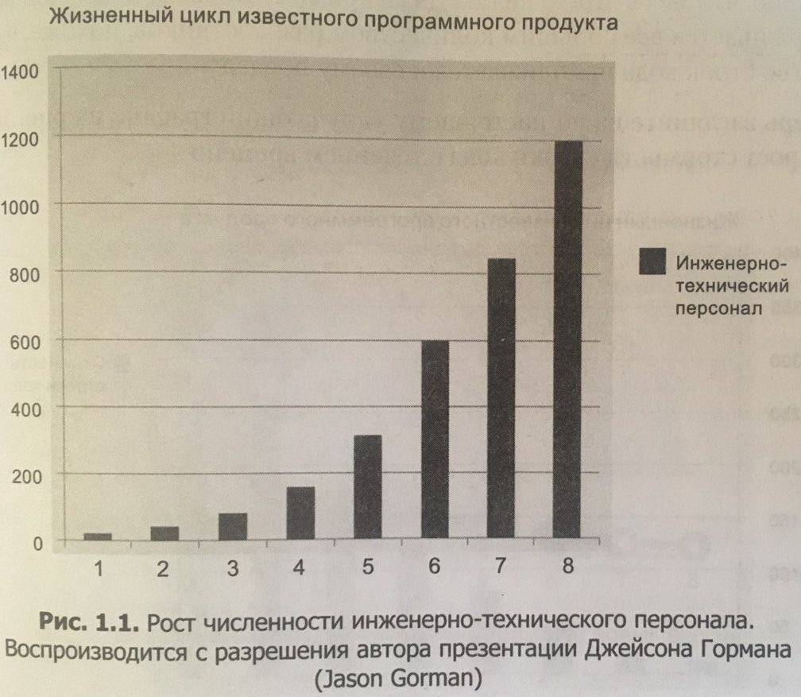
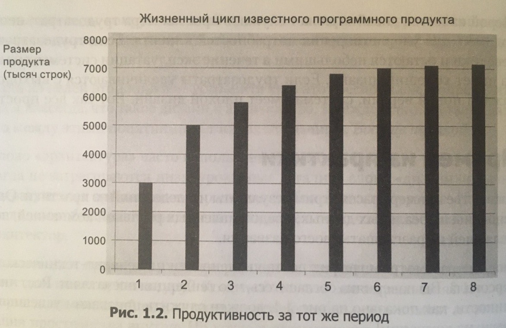
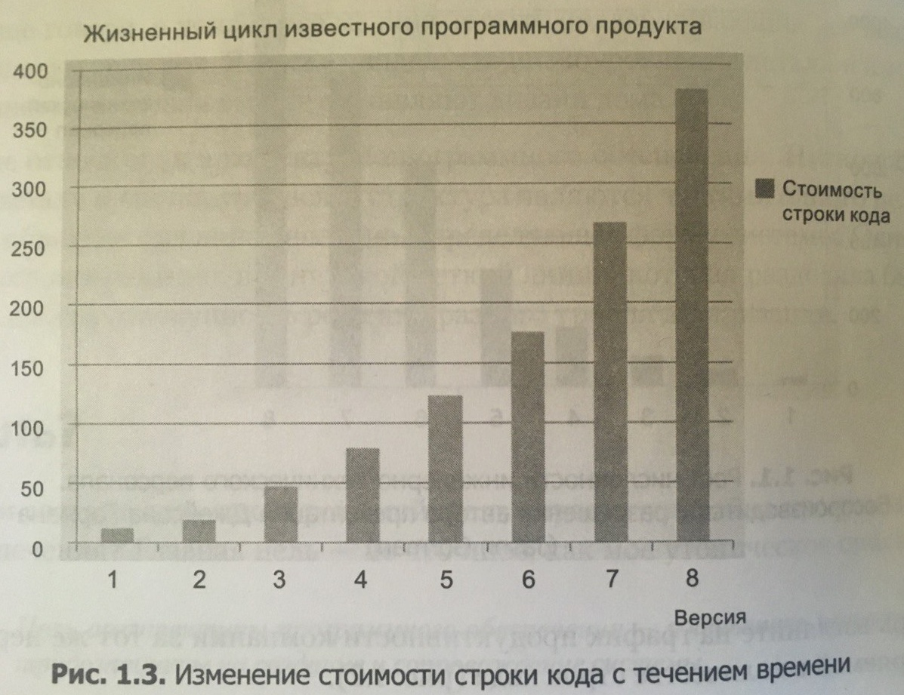

Роберт Мартин уверен, что плохая архитектура обязательно приведет проект в тупик: стоимость поддержки одной строки кода будет бесконечно расти, а мотивация программистов падать. В главе «Что такое дизайн и архитектура» он описывает последствия некачественной архитектуры.

<!--truncate-->

## Предпосылки плохой архитектуры

<figure>
    <blockquote>
        
Когда системы создаются второпях, когда увеличение штата программистов — единственный способ продолжать выпускать новые версии и когда чистоте кода или дизайну уделяется минимум внимания или не уделяется вообще, можно даже не сомневаться, что такая тенденция рано или поздно приведет к краху.

    </blockquote>
    <figcaption>— Р. Мартин, <cite>«Чистая архитектура»</cite></figcaption>
</figure>

## Последствия плохой архитектуры

В качестве примера последствий плохой архитектуры продукта Роберт Мартин приводит три графика:

| Рост количества программистов | Рост продуктивности | Рост стоимости одной строки кода |
|:------|:------|:------|
|  |  |  |

Получается, что с ростом кодовой базы с плохой архитектурой продуктивность работы сотрудников падает, и компании обходится всё дороже поддержка кода:

<figure>
    <blockquote>
        
Эта тенденция говорит о нежизнеспособности. Какой бы рентабельной ни была компания в настоящее время, растущие накладные расходы поглотят прибыль и приведут ее к застою, если не к краху.

    </blockquote>
    <figcaption>— Р. Мартин, <cite>«Чистая архитектура»</cite></figcaption>
</figure>

## Почему разработчики пишут плохой код

Чаще всего по двум причинам: из-за нехватки опыта, или из-за ограниченных сроков. В случае ограниченных сроков, Роберт Мартин описывает подход программистов так:

<figure>
    <blockquote>
        
Разработчики верят в известную ложь: «Мы сможем навести порядок потом, нам бы только выйти на рынок!». В результате порядок так и не наводится, потому что давление конкуренции на рынке никогда не ослабевает. Выход на рынок означает, что теперь у вас на хвосте висят конкуренты и вы должны стремиться оставаться впереди них и бежать вперед изо всех сил.

        
Программисты не могут вернуться и навести порядок, потому что должны реализовать следующую новую функцию, а потом еще одну, и еще, и еще. В результате беспорядок нарастает, а продуктивность стремится к своему пределу около нуля.

    </blockquote>
    <figcaption>— Р. Мартин, <cite>«Чистая архитектура»</cite></figcaption>
</figure>

Еще немного про грязный код и продуктивность:

<figure>
    <blockquote>
        
Самая большая ложь, в которую верят многие разработчики, — что грязный код поможет им быстро выйти на рынок, но в действительности он затормозит их движение в долгосрочной перспективе.

        
Дело в том, что создание беспорядка всегда оказывается медленнее, чем неуклонное соблюдение чистоты.

    </blockquote>
    <figcaption>— Р. Мартин, <cite>«Чистая архитектура»</cite></figcaption>
</figure>

## Что же делать

Нужно стараться изо всех сил держать код в порядке, и выделять время на рефакторинг и наведение чистоты:

<figure>
    <blockquote>
        
Единственный способ обратить вспять снижение продуктивности и увеличение стоимости — заставить разработчиков начать нести ответственность за беспорядок, который они учинили.

        
Разработчики могут подумать, что проблему можно исправить, только начав все с самого начала и перепроектировав всю систему целиком, — но это в них говорит самонадеянность. Самонадеянность, управляющая перепроектированием, приведет к тому же беспорядку, что и прежде.

    </blockquote>
    <figcaption>— Р. Мартин, <cite>«Чистая архитектура»</cite></figcaption>
</figure>
