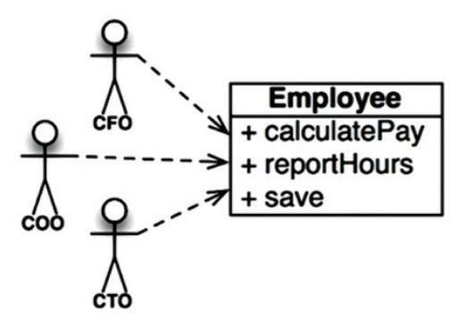
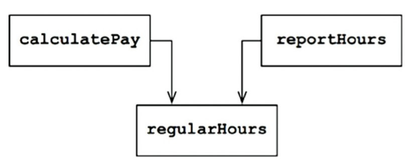
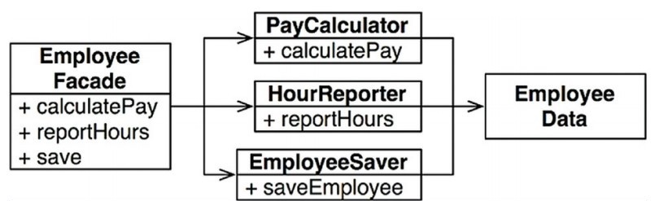

Свою «чистую архитектуру» Роберт Мартин строит на принципах SOLID, которые он же и придумал. Эти принципы очень популярны в объектно-ориентированном программировании.

<!--truncate-->

## Зачем нам SOLID

Мартин не идиализирует свои принципы, а видит их, как хорошое компромиссное решение для построения архитектуры:

<figure>
    <blockquote>
        
Хорошая программная система начинается с чистого кода. С одной стороны, если здание строить из плохих кирпичей, его архитектура не имеет большого значения. С другой стороны, плохие кирпичи можно перемешать с хорошими. Именно на этом основаны принципы SOLID.

    </blockquote>
    <figcaption>— Р. Мартин, <cite>«Чистая архитектура»</cite></figcaption>
</figure>

SOLID это не только про ООП:

<figure>
    <blockquote>
        
Принципы SOLID определяют, как объединять функции и структуры данных в классы и как эти классы должны сочетаться друг с другом. Использование слова «класс» не означает, что эти принципы применимы только к объектно-ориентированному программному коду. В данном случае «класс» означает лишь инструмент объединения функций и данных в группы. Любая программная система имеет такие объединения, как бы они ни назывались, «класс» или как-то еще. Принципы SOLID применяются к этим объединениям.

    </blockquote>
    <figcaption>— Р. Мартин, <cite>«Чистая архитектура»</cite></figcaption>
</figure>

## Пять китов ООП

### Принцип единственной ответсвенности

«Единственная ответственность» — это не про обязанность класса делать что-то одно, а про группу заинтересованных лиц (актора), для которой работает класс:

<figure>
    <blockquote>
        
SRP: Single Responsibility Principle — принцип единственной ответственности.

        
Лучшей является такая структура программной системы, которая формируется в основном под влиянием социальной структуры организации, использующей эту систему, поэтому каждый программный модуль имеет одну и только одну причину для изменения.

    </blockquote>
    <figcaption>— Р. Мартин, <cite>«Чистая архитектура»</cite></figcaption>
</figure>

Как многие ошибочно трактуют этот принцип:

<figure>
    <blockquote>
        
Из всех принципов SOLID наиболее труднопонимаемым является принцип единственной ответственности (Single Responsibility Principle, SRP). Это, вероятно, обусловлено выбором названия, недостаточно точно соответствующего сути. Услышав это название, многие программисты решают: оно означает, что каждый модуль должен отвечать за что-то одно.

        
Самое интересное, что такой принцип <em>действительно</em> существует. Он гласит: <em>функция</em> должна делать что-то одно и только одно. Этот принцип мы используем, когда делим большие функции на меньшие, то есть на более низком уровне. Но он не является одним из принципов SOLID — это не принцип единственной ответственности.

    </blockquote>
    <figcaption>— Р. Мартин, <cite>«Чистая архитектура»</cite></figcaption>
</figure>

Что на самом деле он значит:

<figure>
    <blockquote>
        
Традиционно принцип единственной ответственности описывался так: <em>модуль должен иметь одну и только одну причину для изменения.</em>

        
Программное обеспечение изменяется для удовлетворения нужд пользователей и заинтересованных лиц. Пользователи и заинтересованные лица как раз и есть <em>та самая</em> «причина для изменения», о которой говорит принцип.

    </blockquote>
    <figcaption>— Р. Мартин, <cite>«Чистая архитектура»</cite></figcaption>
</figure>

Пример:

| ❌ Не правильно | ✅ Правильно |
|:------|:------|
|   |  |

### Принцип открытости/закрытости

<figure>
    <blockquote>
        
OCP: Open-Closed Principle — принцип открытости/закрытости.

        
Простая для изменения система должна предусматривать простую возможность изменения ее поведения добавлением нового, но не изменением существующего кода.

        
Этот принцип гласит: <em>программные сущности должны быть открыты для расширения и закрыты для изменения.</em>

        
Иными словами, должна иметься возможность расширять поведение программных сущностей без их изменения.

        
Принцип открытости/закрытости — одна из движущих сил в архитектуре систем. Его цель — сделать систему легко расширяемой и обезопасить ее от влияния изменений. Эта цель достигается делением системы на компоненты и упорядочиванием их зависимостей в иерархию, защищающую компоненты уровнем выше от изменений в компонентах уровнем ниже.

    </blockquote>
    <figcaption>— Р. Мартин, <cite>«Чистая архитектура»</cite></figcaption>
</figure>

### Принцип подстановки Барбары Лисков

<figure>
    <blockquote>
        
LSP: Liskov Substitution Principle — принцип подстановки Барбары Лисков

        
Для создания программных систем из взаимозаменяемых частей эти части должны соответствовать контракту, который позволяет заменять эти части друг другом.

    </blockquote>
    <figcaption>— Р. Мартин, <cite>«Чистая архитектура»</cite></figcaption>
</figure>

### Принцип разделения интерфейсов

<figure>
    <blockquote>
        
ISP: Interface Segregation Principle — принцип разделения интерфейсов.

        
Этот принцип призывает разработчиков программного обеспечения избегать зависимости от всего, что не используется.

        
Опасно создавать зависимости от модулей, содержащих больше, чем требуется. Зависимости, несущие лишний груз ненужных и неиспользуемых особенностей, могут стать причинной неожиданных проблем.

    </blockquote>
    <figcaption>— Р. Мартин, <cite>«Чистая архитектура»</cite></figcaption>
</figure>

### Принцип инверсии зависимости

<figure>
    <blockquote>
        
DIP: Dependency Inversion Principle — принцип инверсии зависимости.

        
Код, реализующий высокоуровневую политику, не должен зависеть от кода, реализующего низкоуровневые детали. Напротив, детали должны зависеть от политики.

        
Этот принцип утверждает, что наиболее гибкими получаются системы, в которых зависимости в исходном коде направлены на абстракции, а не на конкретные реализации.

        
В языках со статической системой типов, таких как Java, это означает, что инструкции use, import и include должны ссылаться только на модули с исходным кодом, содержащим интерфейсы, абстрактные классы и другие абстрактные объявления. Никаких зависимостей от конкретных реализаций не должно быть.

        
То же правило действует для языков с динамической системой типов, таких как Ruby или Python. Исходный код не должен зависеть от модулей с конкретной реализацией. Однако в этих языках труднее определить, что такое конкретный модуль. В частности, это любой модуль, в котором реализованы вызываемые функции.

        
Мы должны избегать зависимости от модулей, которые продолжают активно разрабатываться и претерпевают частые изменения.

    </blockquote>
    <figcaption>— Р. Мартин, <cite>«Чистая архитектура»</cite></figcaption>
</figure>

