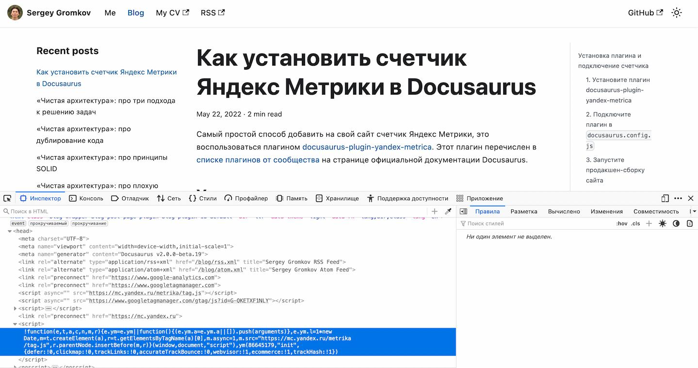
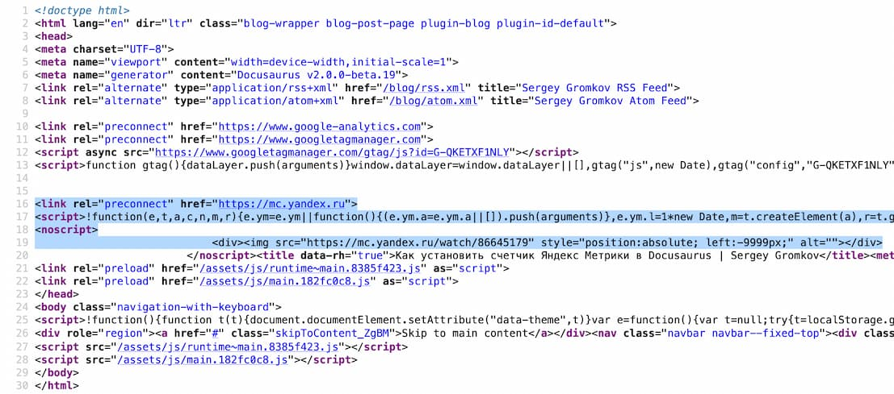

```mdx-code-block
import Tabs from '@theme/Tabs';
import TabItem from '@theme/TabItem';
import BrowserWindow from '@site/src/components/BrowserWindow';
```

Самый простой способ добавить на свой сайт счетчик Яндекс Метрики, это воспользоваться плагином [docusaurus-plugin-yandex-metrica](https://www.npmjs.com/package/docusaurus-plugin-yandex-metrica). Этот плагин перечислен в [списке плагинов от сообщества](https://docusaurus.io/community/resources) на странице официальной документации Docusaurus.

## Установка плагина и подключение счетчика

Следуйте инструкции ниже, чтобы добавить счетчик Яндекс Метрики на свой сайт, созданный на движке Docusaurus.

### 1. Установите плагин *docusaurus-plugin-yandex-metrica*

Плагин _docusaurus-plugin-yandex-metrica_ это npm-пакет, поэтому устанавливается, как зависимость в package.json.

Установите плагин через npm или yarn:

```mdx-code-block
<Tabs>
<TabItem value="npm">
```

```bash
npm install --save docusaurus-plugin-yandex-metrica
```

```mdx-code-block
</TabItem>
<TabItem value="yarn">
```

```bash
yarn add docusaurus-plugin-yandex-metrica
```

```mdx-code-block
</TabItem>
</Tabs>
```

### 2. Подключите плагин в *docusaurus.config.js*

Вставьте название плагина и ID своего счетчика из Яндекс Метрики в массив `plugins` в файле `docusaurus.config.js`:

```js title="docusaurus.config.js"
module.exports = {
  plugins: [
    [
      "docusaurus-plugin-yandex-metrica",
      {
        counterID: "86645179",
      },
    ],
  ],
};
```

### 3. Соберите сайт в продакшен-режиме

Счетчик Яндекс Метрики добавляется только в production-сборку. В dev-режиме его не будет. Это сделано намерено, чтобы не отправлять в вашу Метрику лишнюю статистику, пока вы разрабатываете и тестируете свой сайт на локальном компьютере.

Соберите сайт в продакшен-режиме:

```mdx-code-block
<Tabs>
<TabItem value="npm">
```

```bash
npm run build
```

```mdx-code-block
</TabItem>
<TabItem value="yarn">
```

```bash
yarn run build
```

```mdx-code-block
</TabItem>
</Tabs>
```

### 4. Запустите сайт в продакшен-режиме

Запустите собранный сайт на локальном компьютере:

```mdx-code-block
<Tabs>
<TabItem value="npm">
```

```bash
npm run serve
```

```mdx-code-block
</TabItem>
<TabItem value="yarn">
```

```bash
yarn run serve
```

```mdx-code-block
</TabItem>
</Tabs>
```

### 5. 🎉 Счетчик Яндекс Метрики теперь установлен на вашем сайте!

Откройте любую страницу сайта на локальном компьютере, и посмотрите код этой страницы через инструменты разработчика или откройте исходный код страницы. В секцию `<head>` будет вставлен скрипт вашего счетик:

```mdx-code-block
<Tabs>
<TabItem value="Через инструменты разработчика">
```

<BrowserWindow>



</BrowserWindow>

```mdx-code-block
</TabItem>
<TabItem value="В исходном коде страницы">
```

<BrowserWindow>



</BrowserWindow>

```mdx-code-block
</TabItem>
</Tabs>
```

👏 Примите мои аплодисменты 👏

Вы успешно установили счетчик Яндекс Метрики на свой сайт!
